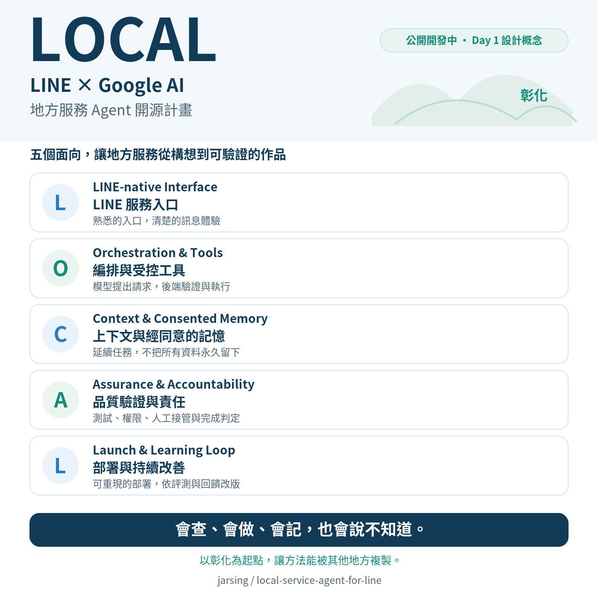

# LOCAL Agent Kit for LINE

[](https://github.com/jarsing/local-service-agent-for-line/actions/workflows/ci.yml)

> Ask through LINE. Let Gemini use tools to find local-service information and explain the result.

[繁體中文](README.zh-TW.md) · [iThome series](https://ithelp.ithome.com.tw/users/20120682/ironman/9872) · [Day 21 setup guide](examples/day21/README.md)

**Author:** Jia-Sin Chen（陳佳新／佳新哥）, ChiBuApp（奇步應用） · GitHub: `jarsing`  
**Series:** LOCAL：30 天打造 LINE × Google AI 地方服務 Agent

Before joining a community walking tour, people ask practical questions: What time should we meet? Where? Can someone using a wheelchair follow the entire route? LOCAL starts with these questions and progressively connects LINE, Gemini, lookup tools, and backend workflows.

This project is for developers with Web, HTTP API, or LINE Bot experience who want to build with Google AI. Each example combines something to try with a design choice to understand.

## What can I try today?

**Code index updated through Day 22, October 6, 2026.** The repository contains the Day 1 acceptance specification and the Day 2–22 examples. The latest example adds **a standalone stop gate and security contract (`examples/day22/circuit_breaker.py`) featuring control epoch invalidation to reject work admitted before a pause, atomic request and outbox commit, CAS claim protection, and three-tier identity separation design with dedicated GitHub Actions offline CI**. Reference code: [Day 22 example](examples/day22/).


| Start with a goal | Entry point | What to explore |
|---|---|---|
| Least privilege, secrets & circuit breaker | [Day 22: Permissions & stop gates](examples/day22/README.md) | Standalone stop gate (`circuit_breaker.py`), epoch invalidation control, atomic request and outbox commit, target three-tier identity architecture, and dedicated CI suite |
| Trace defects across tool calls & backend results | [Day 21: Trace defect localization](examples/day21/README.md) | Inspectable causality chain (`trace_audit.py`), Google Cloud Logging / Cloud Trace structured event mapping, multi-tier defect diagnosis, and PII-safe ID validation |
| Track model configuration, latency & per-task cost | [Day 20: Cost ledger](examples/day20/README.md) | Provenance cost ledger (`cost_ledger.py`), Decimal pricing arithmetic, thinking token billing, 2-second webhook timing gate, and comparable condition verification |
| Volunteer inbox contract & CAS claim | [Day 19: Volunteer inbox](examples/day19/README.md) | Volunteer inbox contract, CAS atomic claim, inbox loop, and timeout reconciliation (human-side verification deferred to Day 26) |
| Evaluate 20 local contracts & triple-layer scoring | [Day 18: 20-case contract eval](examples/day18/README.md) | 20-case benchmark (`eval/local20.json`), 3-layer deterministic scoring, dual-track execution, request rate gate, and counterexample audit |
| Handle empty lookups & service degradation | [Day 17: Typed outcomes & degradation](examples/day17/README.md) | Typed outcomes (no_data / query_unavailable / unsupported), intent routing, fixed recovery buttons, and offline fault injection |
| Defend against untrusted documents & least privilege | [Day 16: Untrusted documents & least privilege](examples/day16/README.md) | Read-only tool allowlist, ADK before_tool_callback, independent backend gate, and offline four zeros |
| Control context budget & sliding window | [Day 15: Context budget](examples/day15/README.md) | 5-layer context engineering, sliding window trimming, structured summaries, and consent-revision invalidation |
| Store consented memory & search local places | [Day 14: Consented memory](examples/day14/README.md) | Third tool `search_local_places`, Changhua Vegfest place data, consented memory lifecycle, and intent routing |
| Present LINE Flex state & safe actions | [Day 13: LINE Flex](examples/day13/README.md) | Fixed Flex bubble templates, postback action binding, stale-card cancel defense, and plain-text accessibility fallback |
| Deploy to Cloud Run & survive restarts | [Day 12: Cloud Run deployment](examples/day12/README.md) | FastAPI webhook, two-phase confirmation with postback action, Secret Manager integration, and cross-revision request recovery |
| Persist state & survive restarts | [Day 11: Firestore persistence](examples/day11/README.md) | Dual-backend storage adapter (SQLite/Firestore emulator verified), cross-process restart recovery, lease-based job coordination, and offline test suite |
| Reconcile timeouts & offline CI | [Day 10: reconciliation & CI](examples/day10/README.md) | Read-only SQLite lookup, synthetic transport timeouts, bounded recovery controller, and GitHub Actions offline CI |
| Build idempotent service requests | [Day 9: request creation & idempotency](examples/day09/README.md) | Google ADK `create_handoff_request`, SQLite transactional deduplication, returning the original request for retries, and rejecting conflicting reuse |
| Bind user confirmation to operations & versions | [Day 8: operation confirmation](examples/day08/README.md) | Google ADK Tool Confirmation, operation fingerprints, version-change interception, and confirmation receipts |
| Handle poster updates and field review | [Day 7: poster versioning](examples/day07/README.md) | Stable event matching, triplet diffs, human review, and three-phase query states |
| Extract event data from a poster | [Day 6: poster extraction](examples/day06/README.md) | Structured fields, quotation verification, human review export, and Day 5 search tool reuse |
| See an agent look up local events | [Day 5: ADK event search](examples/day05/README.md) | Four sample events, four questions, two conditions, and observable tool-call traces |
| Connect Gemini replies to LINE | [Day 4: LINE webhook](examples/day04/README.md) | A fixed `LOCAL ping` reply, followed by `LOCAL 測試` for a model-generated explanation |
| Make a first Gemini call | [Day 3: model experiment](examples/day03/README.md) | Fixed input, original model text, configuration, and usage metadata |
| Begin with a Python-only experiment | [Day 2: SQLite and timeouts](examples/day02/README.md) | A timeout after a committed write, reconciliation, and same-key retries |

This index tracks available code; follow the [iThome series](https://ithelp.ithome.com.tw/users/20120682/ironman/9872) for published articles. Day 2–5 use synthetic sample data; Day 6 experiments with operator-provided and attributed event posters. Most chapter documentation is currently in Traditional Chinese; the commands below provide an English starting point.

## Quickstart: ask for a meeting time and place

Clone the repository with GitHub Desktop, or download and extract the source. Open a terminal in the **repository root**. These commands target macOS/Linux with Python 3.10 or later. On Windows, the virtual-environment interpreter path is `examples/day05/.venv/Scripts/python.exe`.

### 1. Prepare the Day 5 environment and check the interface

```bash
python3 -m venv examples/day05/.venv
examples/day05/.venv/bin/python -m pip install -r examples/day05/requirements.txt
examples/day05/.venv/bin/python -m pip check
examples/day05/.venv/bin/python examples/day05/verify.py --sdk
```

`verify.py` checks event search, reporting, and LINE routing. The `--sdk` option also exercises a real ADK Runner with a scripted model to check the tool round trip. These are offline checks; the next step calls the Gemini API.

Day 5 uses its own virtual environment so that chapter dependencies stay separate. Reuse an existing matching environment when one is already available.

### 2. Run a real event lookup

Set `GEMINI_API_KEY` in your own environment, or follow the [Day 5 guide](examples/day05/README.md) to load a private key file outside the repository. Check your account's usage and billing settings before running:

```bash
examples/day05/.venv/bin/python examples/day05/run.py --live \
  --case meeting --condition with_tool
```

This entry point sends a predefined meeting-information question. The model requests `search_local_events(date, area, keyword)`, Python reads the event data, and ADK returns the result to the model for a final answer.

To run the complete small comparison:

```bash
examples/day05/.venv/bin/python examples/day05/run.py --live
```

The complete batch contains four questions under two conditions: eight agent turns, with a maximum of sixteen model requests. The preceding single-question lookup is a separate turn. Both conditions use the same model and main generation settings; access to event data through the tool is the difference being explored. Answers, events, elapsed time, and available usage metadata are recorded.

### 3. Open the report and follow the lookup

Each run prints its report location, under `output/day05/run-.../` by default:

| File | Purpose |
|---|---|
| `REPORT.html` | Compare answers in a browser and expand the tool request, execution, and response |
| `COMPARISON.md` | Read the original answers for each question and condition |
| `verification.json` | Inspect versions, inputs, original text, events, and usage |

Start with the search arguments, then compare the returned time and meeting point with the answer. When accessibility information is missing, inspect how the model explains that specific gap. The report displays the output from your own run.

For the phone demonstration, continue with the LINE integration section in the [Day 5 guide](examples/day05/README.md). It reuses the Day 4 webhook and additionally requires a LINE test channel, private credentials, and an HTTPS endpoint. The `LOCAL 測試` command currently starts a fixed accessibility question.

## Articles and code map

The articles are written in Traditional Chinese. English topic labels below summarize the published titles.

| Day | Article / topic | Code or specification | Reproduction notes |
|---|---|---|---|
| 1 | [Turn local-service needs into an engineering specification](https://ithelp.ithome.com.tw/articles/10411219) | [First acceptance specification](docs/day01/handoff-timeout-001.json) | Design and acceptance JSON |
| 2 | [Does “done” mean the backend task is complete?](https://ithelp.ithome.com.tw/articles/10412065) | [examples/day02](examples/day02/) | [docs/day02](docs/day02/README.md) |
| 3 | [From AI Studio to a reproducible Gemini API experiment](https://ithelp.ithome.com.tw/articles/10412603) | [examples/day03](examples/day03/) | [docs/day03](docs/day03/README.md) |
| 4 | [Bring Gemini into LINE: verify, then reply](https://ithelp.ithome.com.tw/articles/10413146) | [examples/day04](examples/day04/) | [docs/day04](docs/day04/README.md) |
| 5 | [ADK, controlled lookup, and the first agent orchestration](https://ithelp.ithome.com.tw/articles/10413779) | [examples/day05](examples/day05/) | [docs/day05](docs/day05/README.md) |
| 6 | [Turn an event poster into searchable service data](https://ithelp.ithome.com.tw/articles/10414133) | [examples/day06](examples/day06/) | [docs/day06](docs/day06/README.md) |
| 7 | [Readable does not mean reliable: sources, versions, and the unknown](https://ithelp.ithome.com.tw/articles/10414804) | [examples/day07](examples/day07/) | [docs/day07](docs/day07/README.md) |
| 8 | [A conversational “yes” is not enough: bind confirmation to a specific operation](https://ithelp.ithome.com.tw/articles/10415219) | [examples/day08](examples/day08/) | [docs/day08](docs/day08/README.md) |
| 9 | [Will a second submission create an extra record? Controlled request creation and idempotency](https://ithelp.ithome.com.tw/articles/10415923) | [examples/day09](examples/day09/) | [docs/day09](docs/day09/README.md) |
| 10 | [Did it go through after a timeout? Reconciliation and offline CI](https://ithelp.ithome.com.tw/articles/10416095) | [examples/day10](examples/day10/) | [docs/day10](docs/day10/README.md) |
| 11 | [Service restarted — is what I asked for still there? Resends, background jobs, and restart recovery](https://ithelp.ithome.com.tw/articles/10416397) | [examples/day11](examples/day11/) | [docs/day11](docs/day11/README.md) |
| 12 | [When cloud processes change, is what I asked for still there? First Cloud Run release](https://ithelp.ithome.com.tw/articles/10417489) | [examples/day12](examples/day12/) | [docs/day12](docs/day12/README.md) |
| 13 | [Is a visible button still a valid one? LINE Flex state and safe actions](https://ithelp.ithome.com.tw/articles/10417809) | [examples/day13](examples/day13/) | [docs/day13](docs/day13/README.md) |
| 14 | [“I feel like eating vegetarian today” does not mean forever! Consented memory and place lookup](https://ithelp.ithome.com.tw/articles/10418240) | [examples/day14](examples/day14/) | [docs/day14](docs/day14/README.md) |
| 15 | [As conversations grow longer: Session, summary, and context budget](https://ithelp.ithome.com.tw/articles/10418768) | [examples/day15](examples/day15/) | [docs/day15](docs/day15/README.md) |
| 16 | [Hidden instructions in a flyer: will the system obey? Untrusted documents and least privilege](https://ithelp.ithome.com.tw/articles/10419112) | [examples/day16](examples/day16/) | [docs/day16](docs/day16/README.md) |
| 17 | [Empty result or temporary failure? Typed outcomes and service degradation](https://ithelp.ithome.com.tw/articles/10419526) | [examples/day17](examples/day17/) | [docs/day17](docs/day17/README.md) |
| 18 | [20 local contract evaluation benchmarks: From queries and tools to replies, preserving failures](https://ithelp.ithome.com.tw/articles/10419979) | [examples/day18](examples/day18/) | [eval/local20.json](eval/local20.json) |
| 19 | [Volunteer inbox closed-loop: Minimal human notification and atomic claim](https://ithelp.ithome.com.tw/articles/10420229) | [examples/day19](examples/day19/) | [docs/day19](docs/day19/README.md) |
| 20 | [Model configuration, latency, and per-task cost: Quality before speed and savings](https://ithelp.ithome.com.tw/articles/10420729) | [examples/day20](examples/day20/) | [docs/day20](docs/day20/README.md) |
| 21 | [One trace to find the defect: Follow from model tool call to backend result](https://ithelp.ithome.com.tw/articles/10421328) | [examples/day21](examples/day21/) | [docs/day21](docs/day21/README.md) |
| 22 | [Permissions, Secrets, and Stop Gates: Least Privilege and Circuit Breaking](https://ithelp.ithome.com.tw/articles/10421645) | [examples/day22](examples/day22/) | [docs/day22](docs/day22/README.md) |

Find Day 23 and later articles through the [series page](https://ithelp.ithome.com.tw/users/20120682/ironman/9872). Day 1 delivers a design specification, so executable examples begin at `examples/day02/`.

LOCAL grows as one project, with chapter folders preserving each lesson's focus. Local service requests, idempotent retries, timeout reconciliation, task state persistence / process restart recovery, the first cloud-ready Cloud Run deployment with Firestore, LINE Flex state presentation with defensive postbacks, consented dietary memory lifecycle with local place lookup, multi-tier context engineering with session budgeting, untrusted document defense with read-only capability whitelists, typed outcome service degradation with conversational intent routing, 20-case local contract evaluation benchmarks with deterministic triple-layer scoring, volunteer inbox contract with CAS optimistic locking (human-side verification deferred to Day 26), model configuration / latency / cost analysis ledger, and structured trace defect audit with Cloud Logging mapping are complete through Day 21; Day 22 delivers the standalone stop gate with control epoch invalidation and least-privilege identity separation; upcoming work will explore architectural tradeoffs and tooling choices. This index will expand as the examples are published.


## How LINE, Gemini, and ADK work together

The Day 5 phone demonstration follows this path:

**Fixed LINE command → webhook → Gemini requests a lookup → Python searches events → ADK returns the result → Gemini composes an answer → LINE reply.**

LINE supplies the messaging interface. Gemini interprets the question and requests a tool call. ADK coordinates the model, tools, and events. The Python tool performs the actual lookup. Google AI Studio is the entry point for obtaining and managing Gemini API keys, while Google Antigravity supports the development workflow.

Day 12 adds the LINE teaching service on Cloud Run; Day 14 lands consented dietary memory and place search; Day 17 introduces typed outcomes and service degradation; Day 18 establishes the 20-case contract evaluation harness; Day 19 adds the volunteer inbox contract (human-side verification deferred to Day 26); Day 20 implements the provenance cost ledger; Day 21 introduces structured trace validation and Cloud Logging mapping; Day 22 delivers the controlled stop gate and least-privilege architecture. The current messaging entry point, database experiment, and event search have their own examples; the broader capabilities will be integrated progressively.

## The five LOCAL design dimensions

| Letter | Dimension | Design question |
|---|---|---|
| L | LINE-native Interface | How do users ask, understand results, and continue? |
| O | Orchestration & Tools | How do the model, tools, and backend share the work? |
| C | Context & Consented Memory | What context is needed, and which preferences are stored with consent? |
| A | Assurance & Accountability | What evidence supports the result, and who owns the next step? |
| L | Launch & Learning Loop | How do we deploy, observe problems, and improve the next version? |

These dimensions work together throughout the same evolving service.



## Try an example and share what you find

Start with one example and note where the instructions or behavior are unclear. Leave a comment on the relevant article or open a repository issue with the chapter, code version, and error message. Redact API keys and user data before sharing.

**Which local-service lookup would you give to a tool first?**

## Data and licensing

Use synthetic or explicitly authorized data. Never publish client code, real LINE user IDs, credentials, or private operational data.

The source code is licensed under the MIT License - see the [LICENSE](LICENSE) file for details.

