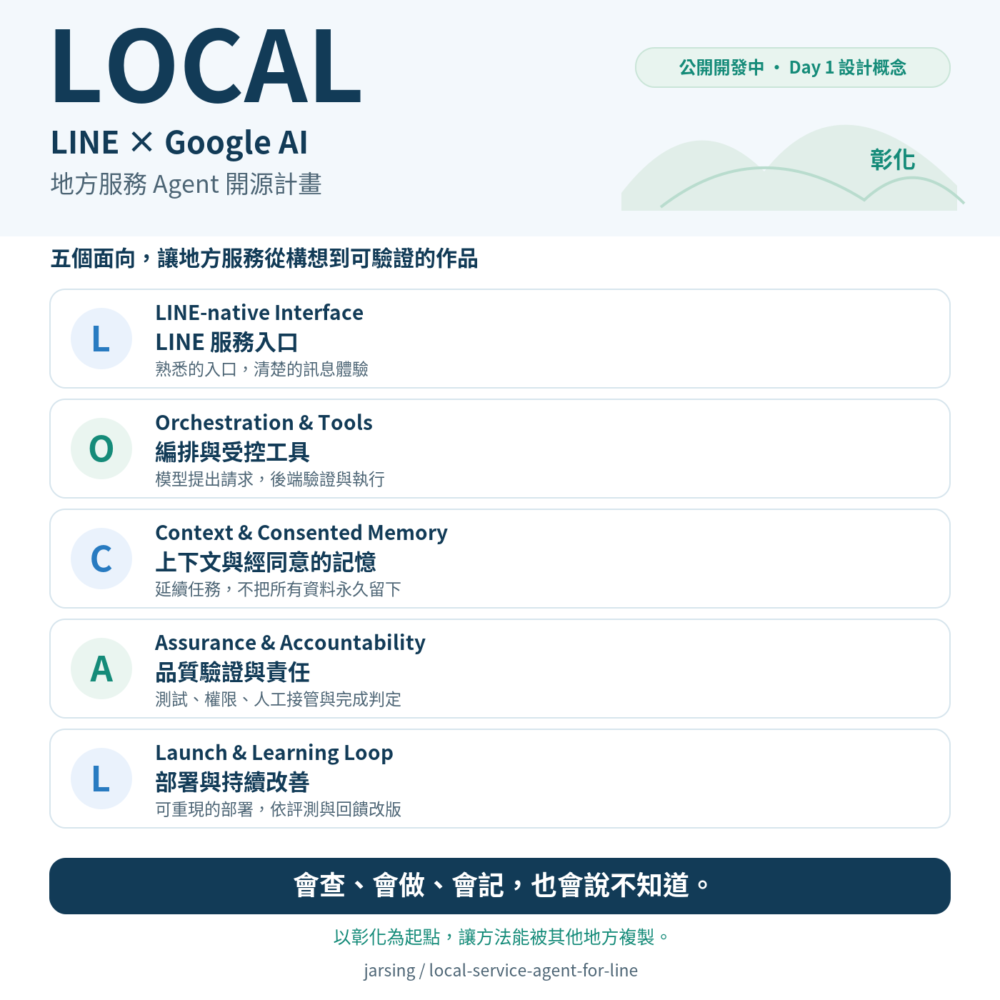

# LOCAL Agent Kit for LINE

> 在 LINE 裡問問題，讓 Gemini 搭配工具查資料，再把結果說清楚。

[English](README.md) · [iThome 連載](https://ithelp.ithome.com.tw/users/20120682/ironman/9872) · [Day 7 操作指南](examples/day07/README.md)

**系列：LOCAL：30 天打造 LINE × Google AI 地方服務 Agent**  
**作者：陳佳新（佳新哥）｜奇步應用｜GitHub：jarsing**

準備參加社區走讀，最先想知道的大概是：「幾點集合？在哪裡碰面？」要是同行者使用輪椅，還得確認整條路線是否方便通行。LOCAL 就從這些地方服務的小問題出發，逐步把 LINE、Gemini、查詢工具與後端流程接起來。

這份教材寫給已有 Web、HTTP API 或 LINE Bot 基礎，想開始使用 Google AI 的開發者。每個範例都有可以動手做的操作，以及值得一起拆解的設計選擇。

## 現在可以從哪裡開始？

**程式導覽更新至 Day 7（2026/09/21）。** Day 1 的驗收規格與 Day 2～7 的範例已在 Repo；目前最新的實作是 **海報來源更新、跨版本場次配對、欄位三元組比對與三階段查詢狀態轉換**。本次導覽依據：[Day 7 程式範例](examples/day07/)。

| 想先做什麼？ | 從這裡開始 | 會看到什麼？ |
|---|---|---|
| 處理海報異動與欄位複核 | [Day 7：海報更新與複核](examples/day07/README.md) | 跨版本活動配對、欄位三元組差分、人工複核與三階段查詢介接 |
| 從海報整理活動資料 | [Day 6：海報資料管線](examples/day06/README.md) | 結構化欄位、原圖原文核對、人工審閱目錄匯出，並接回 Day 5 搜尋工具 |
| 看 Agent 怎麼查活動 | [Day 5：ADK 活動搜尋](examples/day05/README.md) | 四筆活動、四個問題、兩組回答，以及工具的執行軌跡 |
| 把 Gemini 回答接進 LINE | [Day 4：LINE Webhook](examples/day04/README.md) | 先用 `LOCAL ping` 確認往返，再用 `LOCAL 測試` 取得模型說明 |
| 先完成一次 Gemini 呼叫 | [Day 3：模型實驗](examples/day03/README.md) | 固定輸入、模型原文、設定與用量 |
| 先做一個只需要 Python 的實驗 | [Day 2：SQLite 與逾時](examples/day02/README.md) | 同樣遇到逾時，後端卻可能已保存資料；重送時如何查回同一筆 |

程式是否已公開、文章是否已發表，分別由這份導覽與 [iThome 系列頁](https://ithelp.ithome.com.tw/users/20120682/ironman/9872) 查看。Day 2～5 的指定案例採合成資料；Day 6 以操作者提供並註明來源的海報進行實驗。真實服務呼叫與執行結果會在各篇文章中交代。

## 快速開始：先讓 Agent 查到集合資訊

在 GitHub Desktop 複製這個 Repo，或下載並解壓縮程式。接著在 **Repo 根目錄** 開啟終端機。以下指令適用 macOS／Linux，使用 Python 3.10 以上；Windows 的虛擬環境直譯器路徑為 `examples/day05/.venv/Scripts/python.exe`。

### 1. 準備 Day 5 環境並檢查介面

```bash
python3 -m venv examples/day05/.venv
examples/day05/.venv/bin/python -m pip install -r examples/day05/requirements.txt
examples/day05/.venv/bin/python -m pip check
examples/day05/.venv/bin/python examples/day05/verify.py --sdk
```

`verify.py` 檢查搜尋工具、報告與 LINE 路由；`--sdk` 再用真正的 ADK Runner 搭配腳本化模型，檢查工具往返。這一步採離線測試，接下來才使用 Gemini API。

Day 5 使用獨立虛擬環境，各日範例的相依套件分開管理。已建立相符環境的讀者可以直接沿用。

### 2. 執行一次真實活動查詢

先在自己的環境設定 `GEMINI_API_KEY`，或依 [Day 5 指南](examples/day05/README.md) 使用 Repo 外的私人金鑰檔。確認帳戶的用量與費用設定後，執行：

```bash
examples/day05/.venv/bin/python examples/day05/run.py --live \
  --case meeting --condition with_tool
```

這個入口使用預先準備的集合資訊問題，讓模型呼叫 `search_local_events(date, area, keyword)`。資料由 Python 工具讀取，ADK 將結果送回模型，再取得回答。

接著執行完整的小型比較：

```bash
examples/day05/.venv/bin/python examples/day05/run.py --live
```

完整批次是四題、兩組，共八個 Agent 回合，模型請求上限為十六次；前面的單題查詢是另外一個回合。兩組使用相同模型與主要生成設定，差別在能否透過工具取得活動資料。回答、事件、耗時與可取得的用量都會留下紀錄。

### 3. 打開報告，看它怎麼查

每次執行會印出本次報告位置，預設在 `output/day05/run-.../`：

| 檔案 | 用途 |
|---|---|
| `REPORT.html` | 在瀏覽器對照回答，展開工具請求、執行與回傳過程 |
| `COMPARISON.md` | 查看同一問題在有工具、無工具兩組的回答 |
| `verification.json` | 查看版本、輸入、原始文字、事件及用量 |

先找模型提出了哪些搜尋條件，再對照工具回傳的時間與地點。遇到缺少的無障礙欄位，看看模型怎麼說明那一項未知。報告中的答案以你的實際執行為準。

要把同一個 Agent 接進手機，接著看 [Day 5 的 LINE 介接操作](examples/day05/README.md)。它沿用 Day 4 的 Webhook，另外需要 LINE 測試頻道、私人設定與 HTTPS 入口；`LOCAL 測試` 目前觸發固定的無障礙查詢問題。

## 連載與程式地圖

| 日次 | 文章／主題 | 程式或規格 | 重現說明 |
|---|---|---|---|
| Day 1 | [LOCAL：把地方服務需求變成 LINE × Google AI 的工程規格](https://ithelp.ithome.com.tw/articles/10411219) | [第一條驗收規格](docs/day01/handoff-timeout-001.json) | 以設計與驗收 JSON 為起點 |
| Day 2 | [AI 說「完成」真的完成了嗎？把 LOCAL 的第一條驗收規格跑起來](https://ithelp.ithome.com.tw/articles/10412065) | [examples/day02](examples/day02/) | [docs/day02](docs/day02/README.md) |
| Day 3 | [從 AI Studio 到 Gemini API：建立 LOCAL 的第一個可重現模型實驗](https://ithelp.ithome.com.tw/articles/10412603) | [examples/day03](examples/day03/) | [docs/day03](docs/day03/README.md) |
| Day 4 | [讓 Gemini 走進 LINE：先驗簽，再回覆，不把收到當完成](https://ithelp.ithome.com.tw/articles/10413146) | [examples/day04](examples/day04/) | [docs/day04](docs/day04/README.md) |
| Day 5 | [ADK＋受控查詢：第一個 Agent 與 Orchestration](https://ithelp.ithome.com.tw/articles/10413779) | [examples/day05](examples/day05/) | [docs/day05](docs/day05/README.md) |
| Day 6 | [從活動海報到服務資料](https://ithelp.ithome.com.tw/articles/10414133) | [examples/day06](examples/day06/) | [docs/day06](docs/day06/README.md) |
| Day 7 | [主辦更換活動海報：來源更新、版本辨識與欄位複核](https://ithelp.ithome.com.tw/articles/10414804) | [examples/day07](examples/day07/) | [docs/day07](docs/day07/README.md) |

Day 8 及後續文章請由 [系列頁](https://ithelp.ithome.com.tw/users/20120682/ironman/9872) 進入。Day 1 交付的是設計規格，因此程式範例從 `examples/day02/` 開始。

這是一個持續成長的 LOCAL 專案，各日資料夾保留當時的教學重點。後續將加入服務請求、對話狀態、評測與雲端部署；新範例公開後，會持續更新這份導覽。

## LINE、Gemini 與 ADK 各做什麼？

以 Day 5 的 LINE 示範來看：

**LINE 固定指令 → Webhook → Gemini 提出查詢 → Python 工具查活動 → ADK 傳回結果 → Gemini 整理文字 → LINE 回覆。**

LINE 提供訊息入口；Gemini 理解問題並提出工具呼叫；ADK 串起模型、工具與事件。Python 工具負責實際讀取活動資料。Google AI Studio 是 Gemini API 金鑰的取得與管理入口；Google Antigravity 則用在本專案的開發協作。

Google Cloud 部署、經同意的長期記憶與人工服務交接，是後續連載的發展方向。目前的入口、資料庫實驗與活動查詢各有對應範例，完整能力隨系列逐步整合。

## LOCAL 的五個設計面向

| 字母 | 設計面向 | 關心的問題 |
|---|---|---|
| L | LINE-native Interface | 使用者如何提問、看懂結果與繼續操作？ |
| O | Orchestration & Tools | 模型、工具與後端怎麼分工？ |
| C | Context & Consented Memory | 對話需要哪些資訊，哪些偏好經同意後保存？ |
| A | Assurance & Accountability | 用什麼證據確認結果，誰負責下一步？ |
| L | Launch & Learning Loop | 如何部署、觀察問題，再改善下一版？ |

五個面向共同支持同一套服務，會隨實作彼此交織。



## 一起試試看

歡迎從一個範例開始，記下你照著操作時卡住的地方，再到對應文章留言，或在本 Repo 提出 Issue。回報時附上日次、程式版本與錯誤訊息，並遮蔽 API 金鑰及使用者資料，方便一起找到原因。

**你會先把哪一種地方服務查詢交給工具？**

## 授權狀態

本設計版本尚未選定開源授權。公開可見不等於已授予完整開源使用權；程式、文章、圖片與資料的授權範圍，會在提供重用前說清楚。
